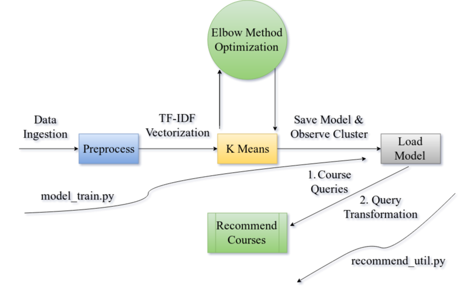
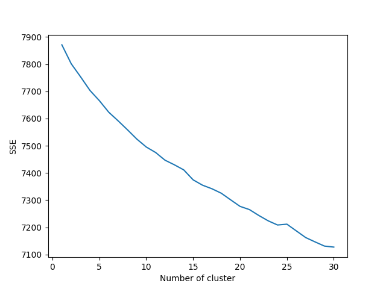
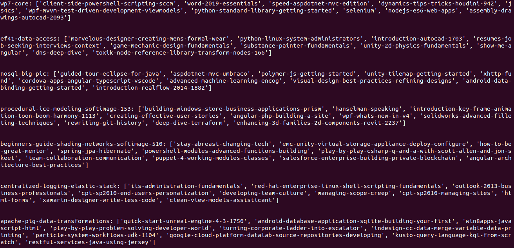
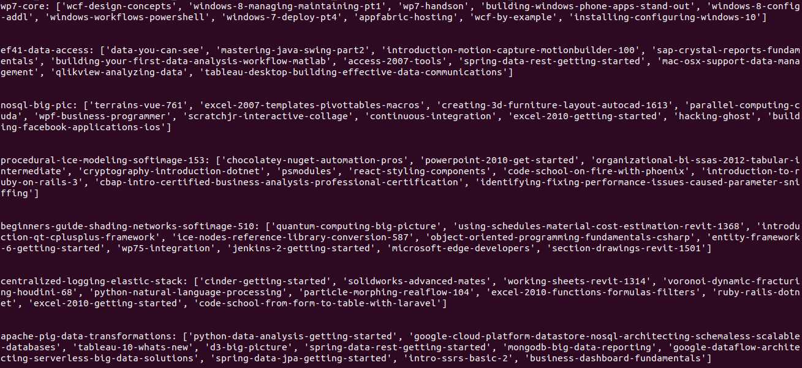
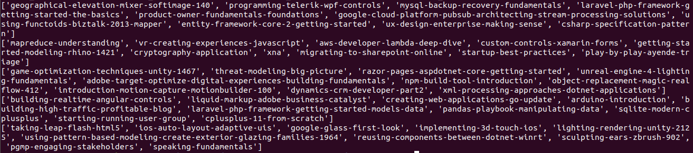
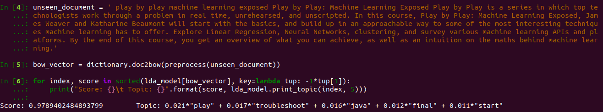

# Online-Course-Recommendation-System

Built on data fetched from Pluralsight's course API fetched results. Refer, their API to use the recent most data.  
Works with model trained on K-means unsupervised clustering algorithm on text data vectorized tf-idf algorithm.  

# Architectural Diagram of Tool

  

# Experiments

__Experiment 1:__ Using k=8 as categories that are present on Pluralsight are eight in number. Just, a basic intuition to get started
with.  

Issue with this approach is that that it results in an higher __SSE__ error as compared other higher values of _k_ as shown in below figure.  

### Elbow Experiment Plot

  

Elbow/Knee method is a good visualization experiment to know where the optimum number of clusters are present. Ideally at a point
where the error decreases drastically.  

__Experiment 2:__ Now, using k=30 as pointed by Elbow's method. The clusters formed are much more meaningful in this experiment. Observe, by printing the top 15 terms of both trained models with k=8 and 30 respectively. Also, for comparison see output screenshots of each clustering experiment.   


# To Get Started

1. Extract out the `finalized_model_k_8 or 30.zip` stored model's zip file first. As, it will be used by `recommend_util.py` file.
2. Extract out the `courses.csv` file. As, it will be used by `recommend_util.py` file for loading the data.
2. Simply, execute 'python3 recommend_util.py'. It will return results for some pre-loaded queries that are already
inserted in this file.

# Training Model

1. Run command 'python3 model_train_k_8.py or python3 model_train_k_30.py' for training the k-means model and storing it.

# Outputs

Observe the outputs for k = 8 and 30 for certain pre-defined courses. It is clearly visible that k=30 returns better recommendations
based on the clustering algorithm of respective trained models.

### Clusterization Output For K = 8

  

### Clusterization Output For K = 30

  


# Limitations

These k-means models perform good when it comes to predicting categories about courses that are in good proportion and is having reasonable number of keywords being associated with them. But, for courses that are less in number of all categories.
The recommendation or predictions of correlated courses associated with a cluster are not good. This can be clearly seen from example below. For these following machine learning courses queries. We received cluster results that are nowhere near good being good recommendations. It highlights the fact that even after minimization of loss via __SSE__ the cluster formed are not that accurate. As, they are correlating course descriptions for different courses that are not related to each other.  

```
Machine learning Course Queries:

play-by-play-machine-learning-exposed
microsoft-cognitive-services-machine-learning
python-scikit-learn-building-machine-learning-models
pandas-data-wrangling-machine-learning-engineers
xgboost-python-scikit-learn-machine-learning
```  

### Cluster results for above mentioned queries
  
  

# A Possible Hope: LDA(Latent Dirichlet Allocation) methods based on BOW model and TF-IDF model

It is a type of statistical modeling for clustering the abstract topics that occur in document collections. It classifies text in a document to a particular topic. And with that idea in mind we'll be aiming to construct clusters around our `courses.csv` data.

Just run `python3 lda_train.py` command.  

Every execution step and information related to it will get printed along with topic analysis related to each word.
In this file main highlights are elimination of extreme values from corpus.
Also, constructing LDA based on TF-IDF model from BOW corpus and a standalone LDA based on BOW model.  

But, still predictions related to machine learning queries for example as mentioned above. Are not good for this model also. Refer figure below, to see the words related predicted with respect to a ML course related query.  

### Query result for 'Play by Play: Machine Learning Exposed'



The major governing term in the above result 'play' is often repeated in the dataset and is often associated with multiple domain courses that are not related to machine learning. Hence, similar problems keep on existing even after training such good models. Another, idea is now to pick up only key phrases related to domains only for obtaining better results. Or train neural networks for better prediction results along with above domain related pharses idea.  

Even, after that results given by this model are slightly better as compared to earlier trained models. Hence, it is better to use `lda_train.py` to train your model and saving it. Plus, making changes accordingly to construct new `recommend_util.py` file.  

# Requirements

Make sure python(3.x), pandas, sklearn, pickle, numpy are present your system for running this module.  

# Kudos !!
